# Diagram Sistem

> Status audit 2026-08-21: diagram menggabungkan implementasi aktif dan target desain. Node pengelolaan akun admin, pembacaan audit log, CRUD jenis tagihan, dan konfigurasi lanjutan adalah planned. Payment history berada di working tree tetapi endpoint read masih terblokir salah permission. Lihat `docs/14-codebase-audit-mitigation-plan.md` sebelum memakai diagram sebagai bukti operasional.

Diagram menggunakan Mermaid agar dapat dirender di GitHub, VS Code, atau dokumentasi statis.

> Diagram yang menyebut CRUD mahasiswa/tagihan kini mewakili fitur aktif. Diagram untuk `payment_methods`, `bill_imports`, dan konfigurasi lanjutan tetap target rilis berikutnya; status aktual ada pada `docs/12-traceability-matrix.md`.

## Daftar Diagram

| Jenis | Tujuan |
|---|---|
| System Context Diagram | Menjelaskan batas sistem dan aktor eksternal. |
| Use Case Diagram | Menjelaskan fungsi utama per aktor. |
| DFD Level 0 | Menjelaskan aliran data tingkat konteks. |
| DFD Level 1 | Menjelaskan aliran data internal proses utama. |
| Activity Diagram Lookup | Menjelaskan keputusan dan aktivitas saat mahasiswa mengecek tagihan. |
| Activity Diagram Import | Menjelaskan aktivitas validasi, preview, dan commit data tagihan. |
| BPMN-style Business Process | Menjelaskan kolaborasi proses antara mahasiswa, sistem, dan admin. |
| User Flow Mahasiswa | Menjelaskan perjalanan mahasiswa saat cek tagihan. |
| User Flow Admin Import | Menjelaskan proses admin saat import data. |
| Sequence Diagram Lookup | Menjelaskan urutan request lookup tagihan. |
| Sequence Diagram Admin Import | Menjelaskan urutan request import tagihan. |
| Sequence Diagram Admin Kelola Data | Menjelaskan alur query terpaginasi dan soft delete data dengan alasan. |
| Sequence Diagram Hapus File Import | Menjelaskan alur soft delete seluruh tagihan per file import dan pembersihan issue. |
| ERD | Menjelaskan relasi entity database. |
| UML-style Class Diagram | Menjelaskan struktur domain object utama. |
| Deployment Diagram | Menjelaskan penempatan komponen di platform. |
| UML-style Component Diagram | Menjelaskan modul aplikasi dan dependency. |
| C4 Container Diagram | Menjelaskan container aplikasi dan hubungan antarplatform. |
| State Diagram Tagihan | Menjelaskan transisi status tagihan. |
| Security Flow | Menjelaskan alur kontrol keamanan publik dan admin. |
| Data Lifecycle Diagram | Menjelaskan siklus data dari sumber hingga retensi atau penghapusan. |
| Data Privacy Flow | Menjelaskan minimisasi, hashing, dan akses data pribadi. |
| Authentication and Authorization Flow | Menjelaskan autentikasi session dan pemeriksaan role admin. |
| Import Validation Decision Tree | Menjelaskan keputusan validasi file sebelum data disimpan. |
| Backup and Recovery Flow | Menjelaskan jalur pemulihan berdasarkan jenis insiden. |
| CI/CD Pipeline Diagram | Menjelaskan alur perubahan dari branch hingga rilis produksi. |
| Sitemap / Information Architecture | Menjelaskan hierarki halaman publik dan admin. |

## System Context Diagram

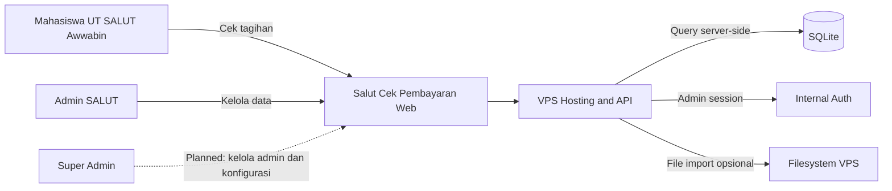

## DFD Level 0

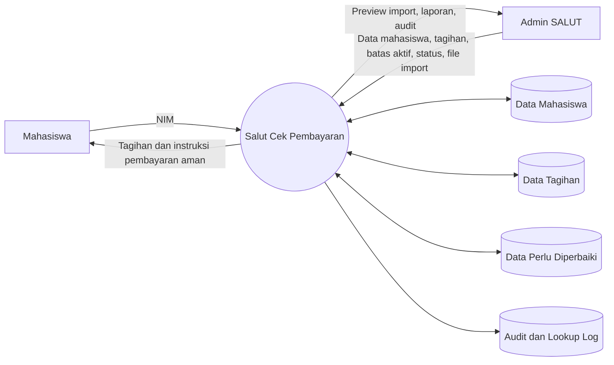

## DFD Level 1

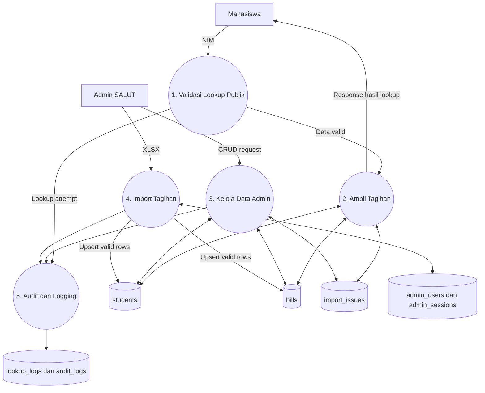

## Use Case Diagram

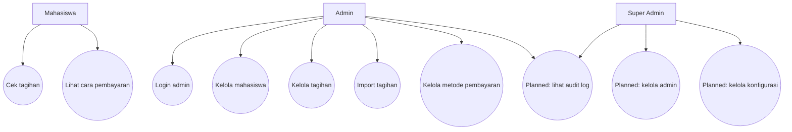

## User Flow Mahasiswa

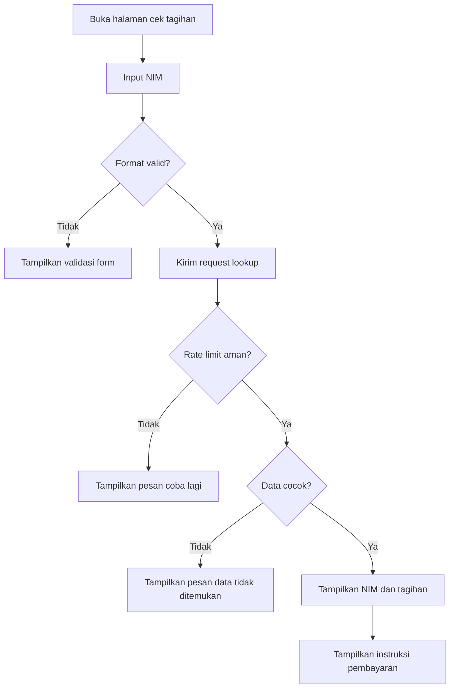

## User Flow Admin Import

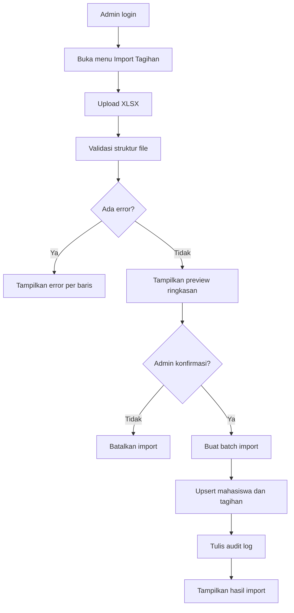

## Sequence Diagram Lookup Tagihan

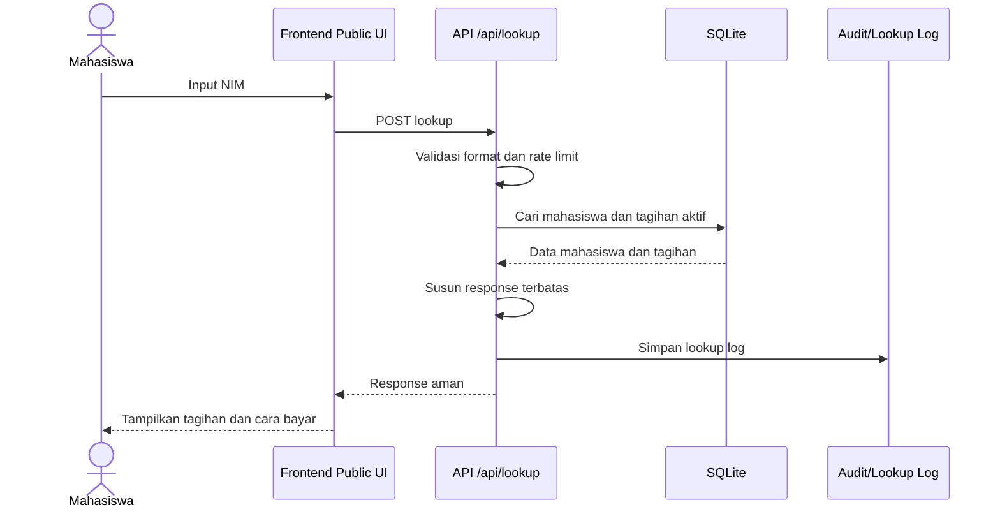

## Sequence Diagram Admin Import

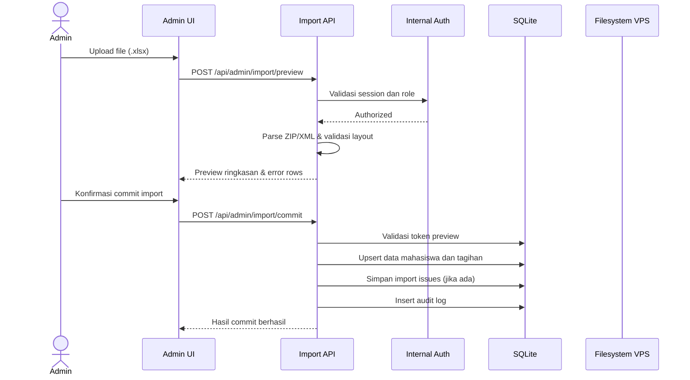

## Sequence Diagram Admin Kelola Data & Soft Delete

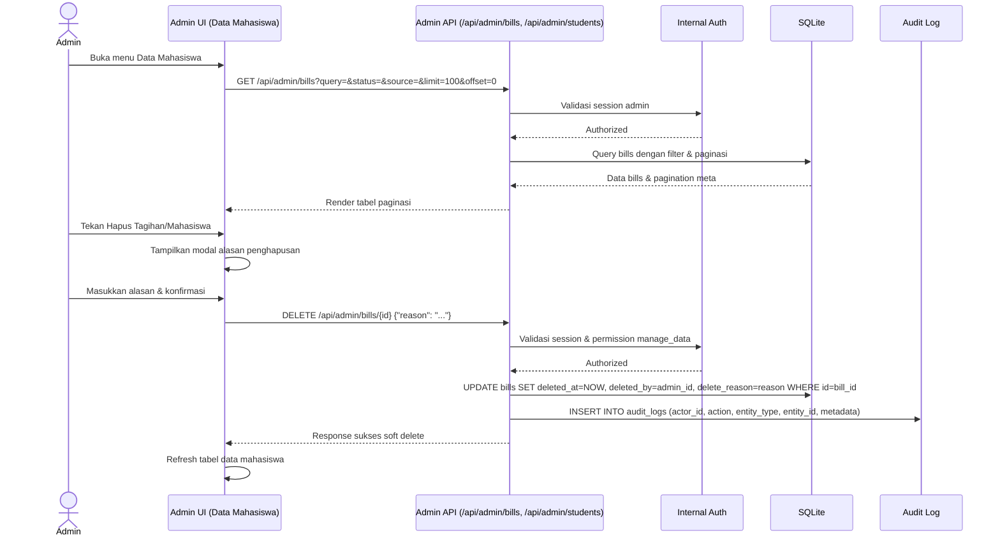

## Sequence Diagram Hapus File Import

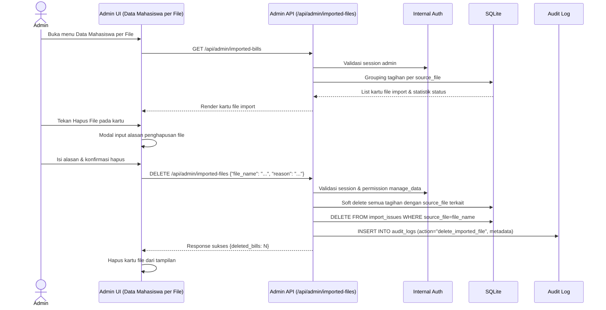

## ERD

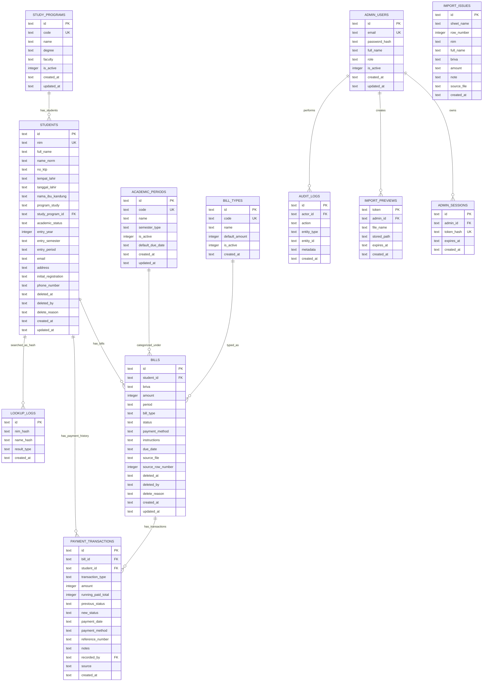

## UML-style Class Diagram

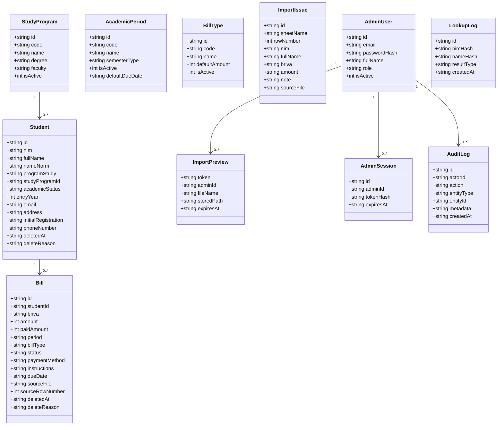

## Deployment Diagram

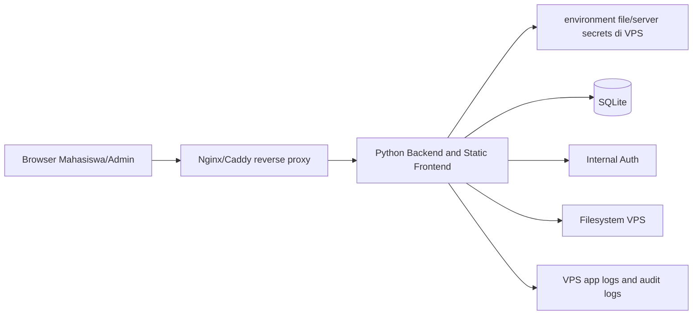

## UML-style Component Diagram

```mermaid
flowchart LR
    subgraph Client[Browser Client]
        PublicUI[Public Lookup UI (HTML/Vanilla JS)]
        AdminSPA[Admin Workspace SPA (React + Vite)]
    end

    subgraph VPS[Backend on VPS]
        PublicAPI[Public Lookup API]
        AdminAPI[Admin & SIAKAD API]
        ImportAPI[Import & Validation API]
        Masking[Data Minimization and Validation]
        RateLimit[Rate Limiter]
        SPAServer[Static SPA File Server]
    end

    subgraph ServerData[Server Data Layer]
        Auth[Internal Auth & RBAC]
        DB[(SQLite salut.sqlite)]
        Storage[File Uploads / Storage]
    end

    PublicUI --> PublicAPI
    AdminSPA --> AdminAPI
    AdminSPA --> ImportAPI
    SPAServer --> AdminSPA
    PublicAPI --> RateLimit
    PublicAPI --> Masking
    PublicAPI --> DB
    AdminAPI --> Auth
    AdminAPI --> DB
    ImportAPI --> Auth
    ImportAPI --> Storage
    ImportAPI --> DB
```

## State Diagram Tagihan

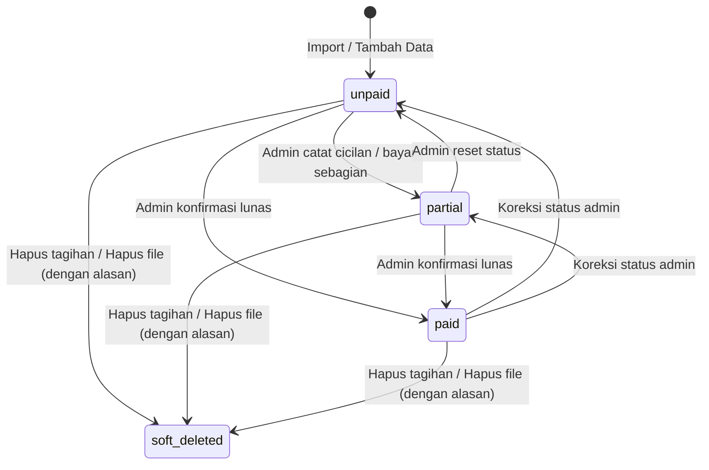

## Security Flow

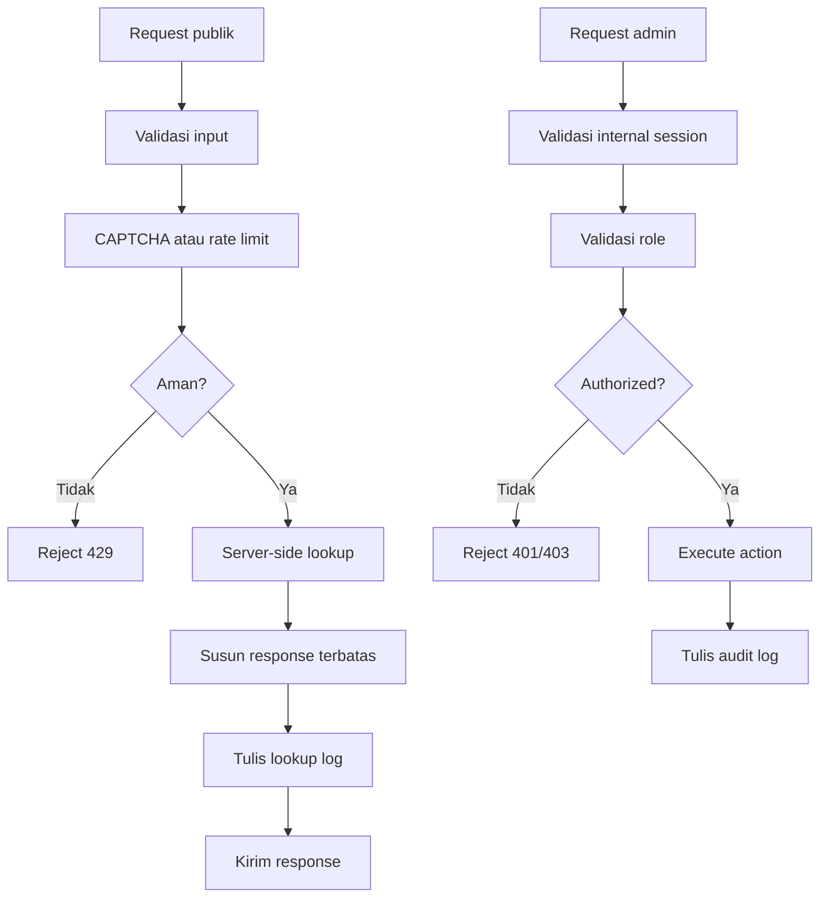

## Activity Diagram Lookup Tagihan


## Activity Diagram Import Tagihan


## BPMN-style Business Process Diagram

Diagram ini menggunakan swimlane Mermaid untuk merepresentasikan kolaborasi proses bisnis tingkat tinggi.

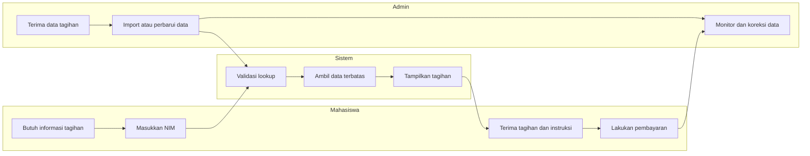

## C4 Container Diagram

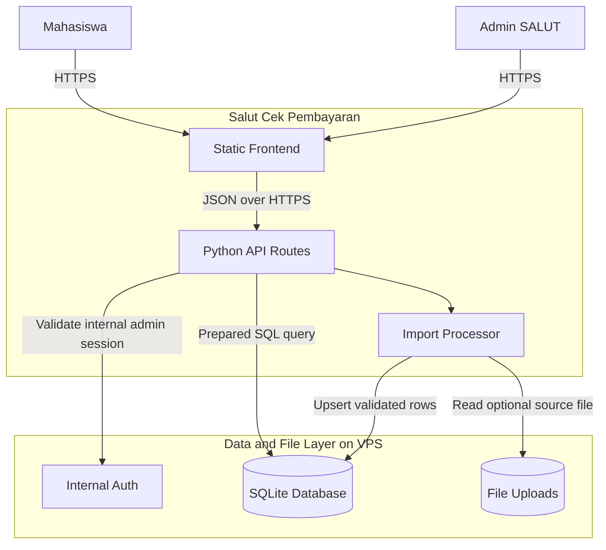

## Data Lifecycle Diagram

```mermaid
flowchart LR
    Source[File sumber tagihan] --> Preview[Parse dan preview]
    Preview --> Commit[Commit batch terverifikasi]
    Commit --> Active[(Database aktif)]
    Active --> Lookup[Lookup publik NIM-only]
    Active --> Admin[Pengelolaan admin]
    Lookup --> LookupLog[(Lookup log ter-hash)]
    Admin --> AuditLog[(Audit log)]
    Active --> Retention{Masa retensi berakhir?}
    Retention -->|Belum| Active
    Retention -->|Ya| Archive[Arsip sesuai kebijakan]
    Archive --> Purge[Hapus secara terkendali]
    LookupLog --> LogPurge[Hapus log sesuai retensi]
    AuditLog --> AuditArchive[Arsip audit sesuai kebijakan]
```

## Data Privacy Flow Diagram

```mermaid
flowchart TD
    Raw[NIM, nama, dan tagihan] --> Server[API server-side]
    Server --> Verify[Verifikasi NIM]
    Server --> Minimize[Batasi response publik]
    Server --> Hash[Hash NIM dan IP untuk log]
    Verify --> Authorized{Kanal akses?}
    Authorized -->|Publik ditemukan| Public[NIM, nama, dan data pembayaran]
    Authorized -->|Admin berizin| Admin[Data sesuai role]
    Minimize --> Public
    Hash --> Logs[(Lookup logs)]
    Admin --> Audit[(Audit logs)]
```

## Authentication and Authorization Flow

```mermaid
sequenceDiagram
    actor Admin
    participant UI as Admin UI
    participant Auth as Internal Auth
    participant API as Admin API
    participant DB as SQLite

    Admin->>UI: Masukkan kredensial
    UI->>Auth: Login email dan password
    Auth-->>UI: Session token
    UI->>API: Request dengan session
    API->>Auth: Validasi session
    Auth-->>API: User terautentikasi
    API->>DB: Ambil role dan status admin
    DB-->>API: Role dan is_active
    API->>API: Periksa izin endpoint
    alt Role diizinkan dan akun aktif
        API-->>UI: Response berhasil
    else Tidak diizinkan
        API-->>UI: 401 atau 403
    end
```

## Import Validation Decision Tree

```mermaid
flowchart TD
    File[File import] --> Type{Tipe dan ukuran file valid?}
    Type -->|Tidak| Reject[Reject preview]
    Type -->|Ya| Header{Header wajib lengkap?}
    Header -->|Tidak| Reject
    Header -->|Ya| Rows{Semua baris valid?}
    Rows -->|Tidak| ShowErrors[Tampilkan error per baris]
    Rows -->|Ya| Duplicate{Ada duplikasi atau konflik?}
    Duplicate -->|Tidak| Preview[Siapkan preview]
    Duplicate -->|Ya| Mode{Konflik dapat di-upsert?}
    Mode -->|Tidak| ShowErrors
    Mode -->|Ya| Preview
    Preview --> Confirm{Admin konfirmasi?}
    Confirm -->|Tidak| Cancel[Batalkan]
    Confirm -->|Ya| Commit[Commit atomik]
    Commit --> Audit[Tulis audit log]
```

## Backup and Recovery Flow

```mermaid
flowchart TD
    Incident[Insiden terdeteksi] --> Classify{Jenis insiden?}
    Classify -->|Deploy bermasalah| Rollback[Rollback service VPS ke release sebelumnya]
    Classify -->|Import data salah| Correct[Nonaktifkan batch dan koreksi data]
    Classify -->|Database rusak| Restore[Restore file SQLite dari backup]
    Classify -->|Secret bocor| Rotate[Rotasi secret dan restart service]
    Rollback --> Verify[Verifikasi integritas dan smoke test]
    Correct --> Verify
    Restore --> Verify
    Rotate --> Verify
    Verify --> Healthy{Layanan sehat?}
    Healthy -->|Tidak| Escalate[Eskalasi dan lanjutkan recovery]
    Healthy -->|Ya| Report[Catat insiden dan tindak lanjut]
    Escalate --> Classify
```

## CI/CD Pipeline Diagram

```mermaid
flowchart LR
    Branch[Feature branch] --> PR[Pull request]
    PR --> Checks[Lint, test, dan build]
    Checks --> Passed{Checks lulus?}
    Passed -->|Tidak| Fix[Perbaiki perubahan]
    Fix --> Branch
    Passed -->|Ya| Staging[Deploy ke staging VPS]
    Staging --> Review[Code review dan UAT]
    Review --> Approved{Disetujui?}
    Approved -->|Tidak| Fix
    Approved -->|Ya| Merge[Merge ke main]
    Merge --> Production[Deploy production ke VPS]
    Production --> Smoke[Smoke test]
    Smoke --> Release[Release notes dan monitoring]
```

## Sitemap / Information Architecture

```mermaid
flowchart TD
    Public[Area Publik] --> Lookup[Cek Tagihan]
    Lookup --> Result[Hasil Tagihan]
    Result --> Payment[Instruksi Pembayaran BRIVA]
    Public --> Help[Bantuan & Panduan Pembayaran]

    AdminArea[Area Admin (React + Vite SPA)] --> Login[Login Admin]
    Login --> Dashboard[Dashboard & Metrik Realtime]
    Dashboard --> Students[Data Mahasiswa & Filter Prodi/Status]
    Students --> Student360[Student Profile 360]
    Dashboard --> Bills[Tagihan Mahasiswa & Status Switcher]
    Dashboard --> Reports[Rekap Keuangan per Prodi & Ekspor CSV]
    Dashboard --> ImportFiles[Data File Import & Batch Delete]
    Dashboard --> UploadWizard[Wizard Upload File Excel 3-Langkah]
    Dashboard --> MasterData[Master Data: Program Studi & Periode Akademik]
```

## Sequence Diagram Edit Tagihan & Bayar Sebagian

```mermaid
sequenceDiagram
    actor Admin
    participant UI as Admin SPA (BillsPage)
    participant API as FastAPI Backend (/api/admin/bills)
    participant Svc as Services (update_bill)
    participant DB as SQLite (bills, academic_periods)
    participant Audit as AuditLog

    Admin->>UI: Buka modal Edit Tagihan
    UI->>UI: Tampilkan identitas mahasiswa (read-only)
    UI->>UI: Inisialisasi dropdown Jenis Tagihan & Periode
    Admin->>UI: Pilih Status "Bayar Sebagian"
    UI->>UI: Tampilkan input nominal dibayar (paid_amount) & sisa real-time
    Admin->>UI: Masukkan paid_amount & submit
    UI->>API: PATCH /api/admin/bills/{id} (payload: amount, paid_amount, period, bill_type, status, etc.)
    API->>Svc: update_bill(db_path, bill_id, payload)
    Svc->>DB: Validasi tagihan & 0 < paid_amount < amount
    alt Periode adalah Custom baru
        Svc->>DB: Auto-register custom period ke academic_periods
    end
    Svc->>DB: UPDATE bills SET amount=?, paid_amount=?, status=?, period=?, ...
    Svc->>Audit: Tulis audit log bill.update
    Svc-->>API: Row tagihan terupdate
    API-->>UI: 200 Success Response (bill data with remaining_amount)
    UI->>Admin: Tampilkan notifikasi sukses & perbarui tabel
```

## Activity Diagram Edit Tagihan Mahasiswa

```mermaid
flowchart TD
    Start([Mulai]) --> OpenModal[Admin klik Edit Tagihan]
    OpenModal --> RenderInfo[Sistem menampilkan info mahasiswa read-only]
    RenderInfo --> SelectType[Admin pilih Jenis Tagihan]
    SelectType --> IsCustomType{Jenis = Custom?}
    IsCustomType -->|Ya| InputCustomType[Input nama jenis tagihan kustom]
    IsCustomType -->|Tidak| SelectPeriod[Admin pilih Periode Akademik]
    InputCustomType --> SelectPeriod
    SelectPeriod --> IsCustomPeriod{Periode = Custom?}
    IsCustomPeriod -->|Ya| InputCustomPeriod[Input kode periode kustom]
    IsCustomPeriod -->|Tidak| SelectStatus[Admin pilih Status Pembayaran]
    InputCustomPeriod --> SelectStatus
    SelectStatus --> CheckStatus{Status = Bayar Sebagian?}
    CheckStatus -->|Ya| InputPaidAmount[Admin masukkan nominal yang dibayar]
    InputPaidAmount --> CalcRemain[Sistem hitung sisa tagihan real-time]
    CheckStatus -->|Tidak| Submit[Admin klik Simpan Tagihan]
    CalcRemain --> ValidatePaid{0 < paid_amount < amount?}
    ValidatePaid -->|Tidak| ShowValErr[Tampilkan error validasi nominal]
    ShowValErr --> InputPaidAmount
    ValidatePaid -->|Ya| Submit
    Submit --> SaveDB[(Simpan update ke database)]
    SaveDB --> RecordTx[Catat payment_transaction]
    RecordTx --> WriteAudit[Catat ke audit_logs]
    WriteAudit --> Notify[Tampilkan notifikasi sukses]
    Notify --> End([Selesai])
```

## Sequence Diagram Pencatatan Transaksi Pembayaran

```mermaid
sequenceDiagram
    actor Admin
    participant UI as Admin SPA
    participant API as FastAPI Backend
    participant Svc as Services
    participant DB as SQLite

    Admin->>UI: Ubah status tagihan (misal unpaid -> partial)
    UI->>API: POST /api/admin/bills/status
    API->>Svc: update_bill_status(bill_id, status, paid_amount)
    Svc->>DB: SELECT current bill (status, paid_amount)
    DB-->>Svc: old_status=unpaid, old_paid=0
    Svc->>DB: UPDATE bills SET status=partial, paid_amount=500000
    Svc->>Svc: Hitung transaction_type, amount delta
    Svc->>DB: INSERT INTO payment_transactions (type=payment, amount=500000, running_total=500000, prev=unpaid, new=partial)
    Svc->>DB: INSERT INTO audit_logs
    Svc-->>API: Updated bill row
    API-->>UI: 200 Success
    UI->>Admin: Tampilkan notifikasi sukses
```
