# Diagram Sistem

Diagram menggunakan Mermaid agar dapat dirender di GitHub, VS Code, atau dokumentasi statis.

> Diagram yang menyebut CRUD mahasiswa/tagihan kini mewakili fitur aktif. Diagram untuk `payment_methods`, `bill_imports`, dan konfigurasi lanjutan tetap target rilis berikutnya; status aktual ada pada `docs/12-traceability-matrix.md`.

## Daftar Diagram

| Jenis | Tujuan |
|---|---|
| System Context Diagram | Menjelaskan batas sistem dan aktor eksternal. |
| Use Case Diagram | Menjelaskan fungsi utama per aktor. |
| DFD Level 0 | Menjelaskan aliran data tingkat konteks. |
| DFD Level 1 | Menjelaskan aliran data internal proses utama. |
| Activity Diagram Lookup | Menjelaskan keputusan dan aktivitas saat mahasiswa mengecek tagihan. |
| Activity Diagram Import | Menjelaskan aktivitas validasi, preview, dan commit data tagihan. |
| BPMN-style Business Process | Menjelaskan kolaborasi proses antara mahasiswa, sistem, dan admin. |
| User Flow Mahasiswa | Menjelaskan perjalanan mahasiswa saat cek tagihan. |
| User Flow Admin Import | Menjelaskan proses admin saat import data. |
| Sequence Diagram Lookup | Menjelaskan urutan request lookup tagihan. |
| Sequence Diagram Admin Import | Menjelaskan urutan request import tagihan. |
| ERD | Menjelaskan relasi entity database. |
| UML-style Class Diagram | Menjelaskan struktur domain object utama. |
| Deployment Diagram | Menjelaskan penempatan komponen di platform. |
| UML-style Component Diagram | Menjelaskan modul aplikasi dan dependency. |
| C4 Container Diagram | Menjelaskan container aplikasi dan hubungan antarplatform. |
| State Diagram Tagihan | Menjelaskan transisi status tagihan. |
| Security Flow | Menjelaskan alur kontrol keamanan publik dan admin. |
| Data Lifecycle Diagram | Menjelaskan siklus data dari sumber hingga retensi atau penghapusan. |
| Data Privacy Flow | Menjelaskan minimisasi, hashing, dan akses data pribadi. |
| Authentication and Authorization Flow | Menjelaskan autentikasi session dan pemeriksaan role admin. |
| Import Validation Decision Tree | Menjelaskan keputusan validasi file sebelum data disimpan. |
| Backup and Recovery Flow | Menjelaskan jalur pemulihan berdasarkan jenis insiden. |
| CI/CD Pipeline Diagram | Menjelaskan alur perubahan dari branch hingga rilis produksi. |
| Sitemap / Information Architecture | Menjelaskan hierarki halaman publik dan admin. |

## System Context Diagram

```mermaid
flowchart LR
    Student[Mahasiswa UT SALUT Awwabin]
    Admin[Admin SALUT]
    SuperAdmin[Super Admin]
    Web[Salut Cek Pembayaran Web]
    VPS[VPS Hosting and API]
    SQLite[(SQLite)]
    Auth[Internal Auth]
    Storage[Filesystem VPS]

    Student -->|Cek tagihan| Web
    Admin -->|Kelola data| Web
    SuperAdmin -->|Kelola admin dan konfigurasi| Web
    Web --> VPS
    VPS -->|Query server-side| SQLite
    VPS -->|Admin session| Auth
    VPS -->|File import opsional| Storage
```

## DFD Level 0

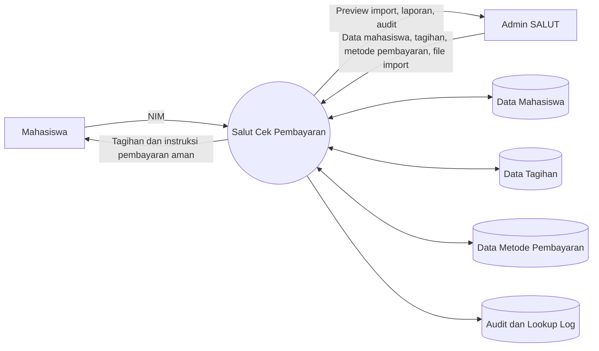
```mermaid
flowchart LR
    Student[Mahasiswa]
    Admin[Admin SALUT]
    System((Salut Cek Pembayaran))
    StudentData[(Data Mahasiswa)]
    BillData[(Data Tagihan)]
    PaymentData[(Data Metode Pembayaran)]
    AuditData[(Audit dan Lookup Log)]

    Student -->|NIM| System
    System -->|Tagihan dan instruksi pembayaran aman| Student
    Admin -->|Data mahasiswa, tagihan, metode pembayaran, file import| System
    System -->|Preview import, laporan, audit| Admin
    System <--> StudentData
    System <--> BillData
    System <--> PaymentData
    System --> AuditData
```

## DFD Level 1

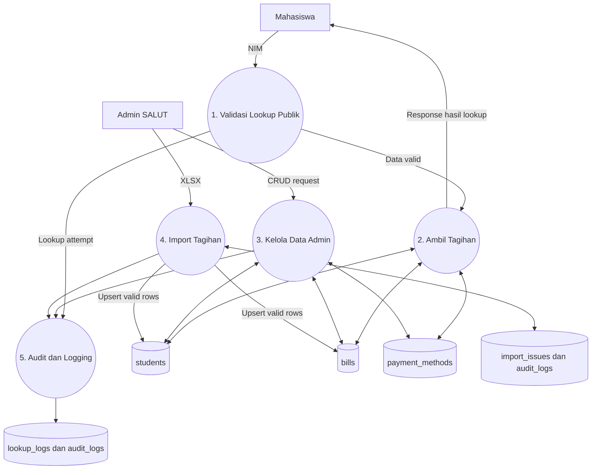
```mermaid
flowchart TD
    Student[Mahasiswa]
    Admin[Admin SALUT]
    P1((1. Validasi Lookup Publik))
    P2((2. Ambil Tagihan))
    P3((3. Kelola Data Admin))
    P4((4. Import Tagihan))
    P5((5. Audit dan Logging))
    D1[(students)]
    D2[(bills)]
    D3[(payment_methods)]
    D4[(import_issues dan audit_logs)]
    D5[(lookup_logs dan audit_logs)]

    Student -->|NIM| P1
    P1 -->|Data valid| P2
    P1 -->|Lookup attempt| P5
    P2 <--> D1
    P2 <--> D2
    P2 <--> D3
    P2 -->|Response hasil lookup| Student

    Admin -->|CRUD request| P3
    P3 <--> D1
    P3 <--> D2
    P3 <--> D3
    P3 --> P5

    Admin -->|XLSX| P4
    P4 <--> D4
    P4 -->|Upsert valid rows| D1
    P4 -->|Upsert valid rows| D2
    P4 --> P5
    P5 --> D5
```

## Use Case Diagram

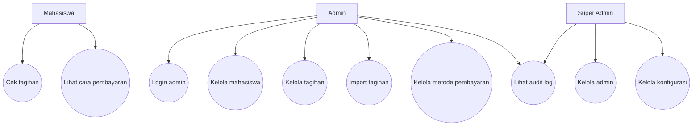
```mermaid
flowchart TB
    Student[Mahasiswa]
    Admin[Admin]
    SuperAdmin[Super Admin]

    UC1((Cek tagihan))
    UC2((Lihat cara pembayaran))
    UC3((Login admin))
    UC4((Kelola mahasiswa))
    UC5((Kelola tagihan))
    UC6((Import tagihan))
    UC7((Kelola metode pembayaran))
    UC8((Lihat audit log))
    UC9((Kelola admin))
    UC10((Kelola konfigurasi))

    Student --> UC1
    Student --> UC2
    Admin --> UC3
    Admin --> UC4
    Admin --> UC5
    Admin --> UC6
    Admin --> UC7
    Admin --> UC8
    SuperAdmin --> UC9
    SuperAdmin --> UC10
    SuperAdmin --> UC8
```

## User Flow Mahasiswa

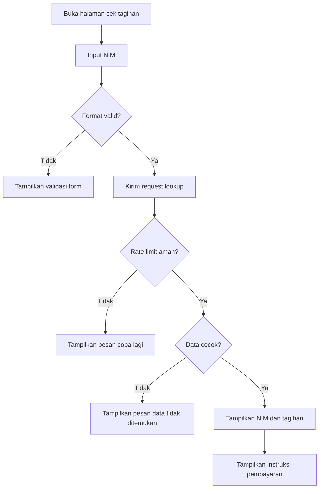
```mermaid
flowchart TD
    A[Buka halaman cek tagihan] --> B[Input NIM]
    B --> D{Format valid?}
    D -->|Tidak| E[Tampilkan validasi form]
    D -->|Ya| F[Kirim request lookup]
    F --> G{Rate limit aman?}
    G -->|Tidak| H[Tampilkan pesan coba lagi]
    G -->|Ya| I{Data cocok?}
    I -->|Tidak| J[Tampilkan pesan data tidak ditemukan]
    I -->|Ya| K[Tampilkan NIM dan tagihan]
    K --> L[Tampilkan instruksi pembayaran]
```

## User Flow Admin Import

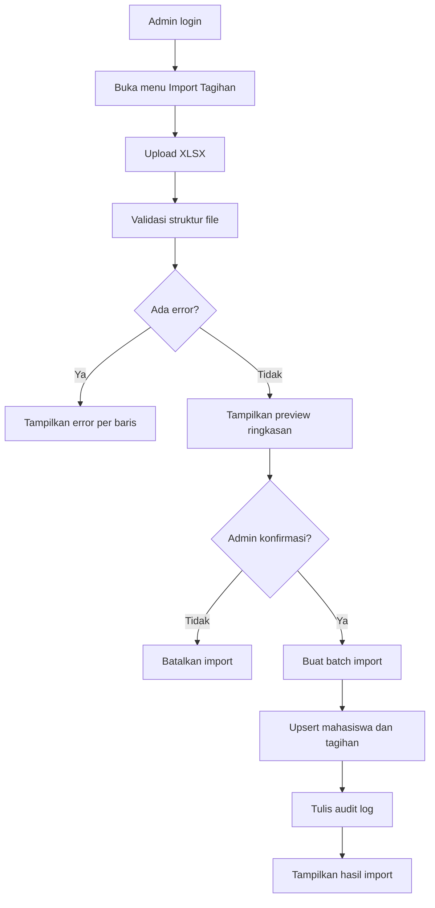
```mermaid
flowchart TD
    A[Admin login] --> B[Buka menu Import Tagihan]
    B --> C[Upload XLSX]
    C --> D[Validasi struktur file]
    D --> E{Ada error?}
    E -->|Ya| F[Tampilkan error per baris]
    E -->|Tidak| G[Tampilkan preview ringkasan]
    G --> H{Admin konfirmasi?}
    H -->|Tidak| I[Batalkan import]
    H -->|Ya| J[Buat batch import]
    J --> K[Upsert mahasiswa dan tagihan]
    K --> L[Tulis audit log]
    L --> M[Tampilkan hasil import]
```

## Sequence Diagram Lookup Tagihan

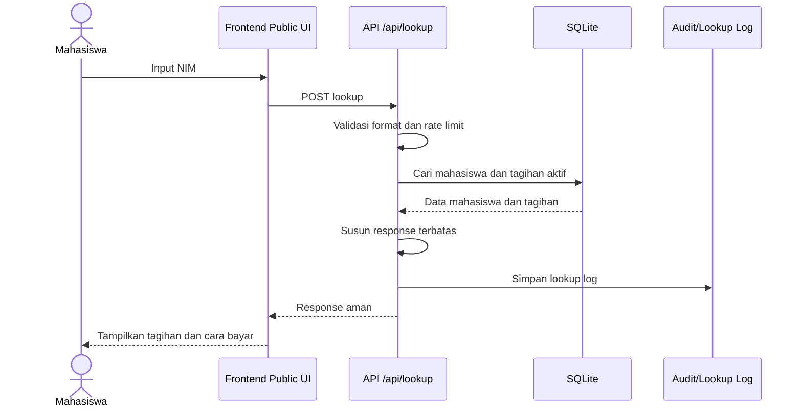
```mermaid
sequenceDiagram
    actor Student as Mahasiswa
    participant UI as Frontend Public UI
    participant API as API /api/lookup
    participant DB as SQLite
    participant Log as Audit/Lookup Log

    Student->>UI: Input NIM
    UI->>API: POST lookup
    API->>API: Validasi format dan rate limit
    API->>DB: Cari mahasiswa dan tagihan aktif
    DB-->>API: Data mahasiswa dan tagihan
    API->>API: Susun response terbatas
    API->>Log: Simpan lookup log
    API-->>UI: Response aman
    UI-->>Student: Tampilkan tagihan dan cara bayar
```

## Sequence Diagram Admin Import

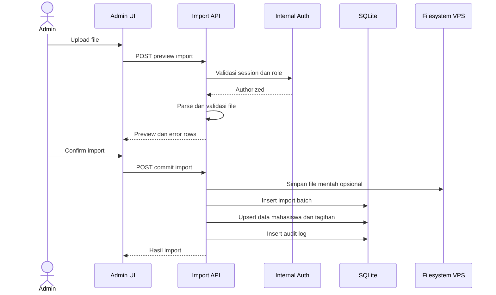
```mermaid
sequenceDiagram
    actor Admin
    participant UI as Admin UI
    participant API as Import API
    participant Auth as Internal Auth
    participant DB as SQLite
    participant Storage as Filesystem VPS

    Admin->>UI: Upload file
    UI->>API: POST preview import
    API->>Auth: Validasi session dan role
    Auth-->>API: Authorized
    API->>API: Parse dan validasi file
    API-->>UI: Preview dan error rows
    Admin->>UI: Confirm import
    UI->>API: POST commit import
    API->>Storage: Simpan file mentah opsional
    API->>DB: Insert import batch
    API->>DB: Upsert data mahasiswa dan tagihan
    API->>DB: Insert audit log
    API-->>UI: Hasil import
```

## ERD

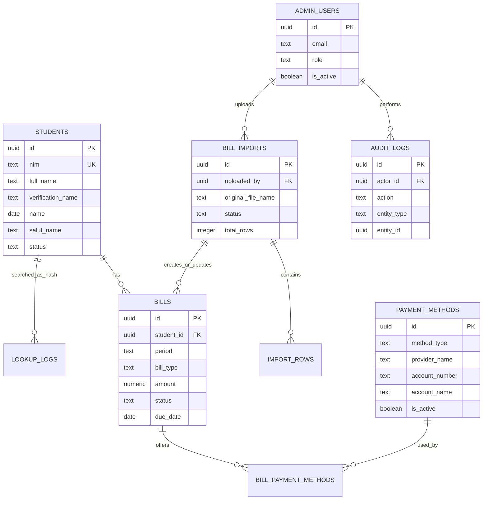
```mermaid
erDiagram
    STUDENTS ||--o{ BILLS : has
    STUDENTS ||--o{ LOOKUP_LOGS : searched_as_hash
    BILL_IMPORTS ||--o{ IMPORT_ROWS : contains
    BILL_IMPORTS ||--o{ BILLS : creates_or_updates
    PAYMENT_METHODS ||--o{ BILL_PAYMENT_METHODS : used_by
    BILLS ||--o{ BILL_PAYMENT_METHODS : offers
    ADMIN_USERS ||--o{ AUDIT_LOGS : performs
    ADMIN_USERS ||--o{ BILL_IMPORTS : uploads

    STUDENTS {
        uuid id PK
        text nim UK
        text full_name
        text verification_name
        date name
        text salut_name
        text status
    }

    BILLS {
        uuid id PK
        uuid student_id FK
        text period
        text bill_type
        numeric amount
        text status
        date due_date
    }

    PAYMENT_METHODS {
        uuid id PK
        text method_type
        text provider_name
        text account_number
        text account_name
        boolean is_active
    }

    BILL_IMPORTS {
        uuid id PK
        uuid uploaded_by FK
        text original_file_name
        text status
        integer total_rows
    }

    ADMIN_USERS {
        uuid id PK
        text email
        text role
        boolean is_active
    }

    AUDIT_LOGS {
        uuid id PK
        uuid actor_id FK
        text action
        text entity_type
        uuid entity_id
    }
```

## UML-style Class Diagram

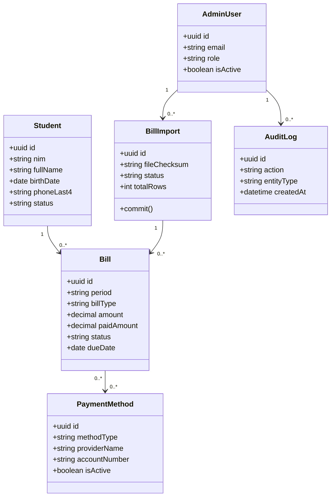
```mermaid
classDiagram
    class Student {
        +uuid id
        +string nim
        +string fullName
        +date birthDate
        +string phoneLast4
        +string status
    }

    class Bill {
        +uuid id
        +string period
        +string billType
        +decimal amount
        +decimal paidAmount
        +string status
        +date dueDate
    }

    class PaymentMethod {
        +uuid id
        +string methodType
        +string providerName
        +string accountNumber
        +boolean isActive
    }

    class BillImport {
        +uuid id
        +string fileChecksum
        +string status
        +int totalRows
        +commit()
    }

    class AdminUser {
        +uuid id
        +string email
        +string role
        +boolean isActive
    }

    class AuditLog {
        +uuid id
        +string action
        +string entityType
        +datetime createdAt
    }

    Student "1" --> "0..*" Bill
    Bill "0..*" --> "0..*" PaymentMethod
    BillImport "1" --> "0..*" Bill
    AdminUser "1" --> "0..*" BillImport
    AdminUser "1" --> "0..*" AuditLog
```

## Deployment Diagram

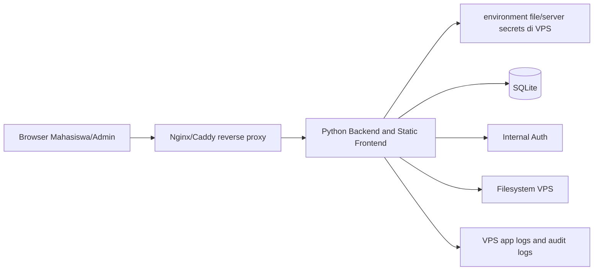
```mermaid
flowchart LR
    Browser[Browser Mahasiswa/Admin]
    CDN[Nginx/Caddy reverse proxy]
    Next[Python Backend and Static Frontend]
    Env[environment file/server secrets di VPS]
    DB[(SQLite)]
    Auth[Internal Auth]
    Storage[Filesystem VPS]
    Logs[VPS app logs and audit logs]

    Browser --> CDN
    CDN --> Next
    Next --> Env
    Next --> DB
    Next --> Auth
    Next --> Storage
    Next --> Logs
```

## UML-style Component Diagram

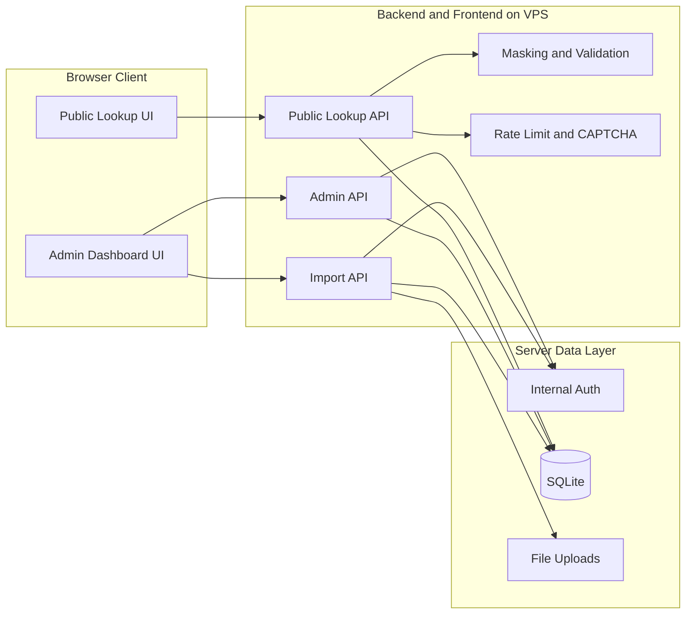
```mermaid
flowchart LR
    subgraph Client[Browser Client]
        PublicUI[Public Lookup UI]
        AdminUI[Admin Dashboard UI]
    end

    subgraph VPS[Backend and Frontend on VPS]
        PublicAPI[Public Lookup API]
        AdminAPI[Admin API]
        ImportAPI[Import API]
        Masking[Masking and Validation]
        RateLimit[Rate Limit and CAPTCHA]
    end

    subgraph ServerData[Server Data Layer]
        Auth[Internal Auth]
        DB[(SQLite)]
        Storage[File Uploads]
    end

    PublicUI --> PublicAPI
    AdminUI --> AdminAPI
    AdminUI --> ImportAPI
    PublicAPI --> RateLimit
    PublicAPI --> Masking
    PublicAPI --> DB
    AdminAPI --> Auth
    AdminAPI --> DB
    ImportAPI --> Auth
    ImportAPI --> Storage
    ImportAPI --> DB
```

## State Diagram Tagihan

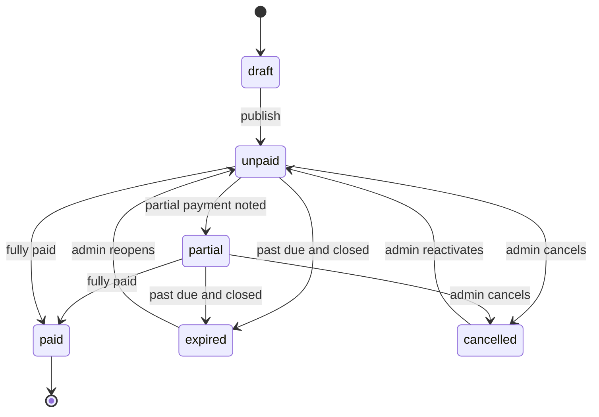
```mermaid
stateDiagram-v2
    [*] --> draft
    draft --> unpaid: publish
    unpaid --> partial: partial payment noted
    partial --> paid: fully paid
    unpaid --> paid: fully paid
    unpaid --> expired: past due and closed
    partial --> expired: past due and closed
    unpaid --> cancelled: admin cancels
    partial --> cancelled: admin cancels
    expired --> unpaid: admin reopens
    cancelled --> unpaid: admin reactivates
    paid --> [*]
```

## Security Flow

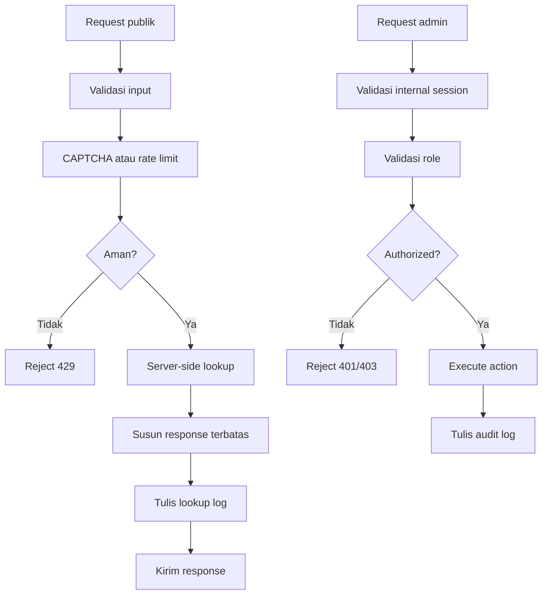
```mermaid
flowchart TD
    A[Request publik] --> B[Validasi input]
    B --> C[CAPTCHA atau rate limit]
    C --> D{Aman?}
    D -->|Tidak| E[Reject 429]
    D -->|Ya| F[Server-side lookup]
    F --> G[Susun response terbatas]
    G --> H[Tulis lookup log]
    H --> I[Kirim response]

    J[Request admin] --> K[Validasi internal session]
    K --> L[Validasi role]
    L --> M{Authorized?}
    M -->|Tidak| N[Reject 401/403]
    M -->|Ya| O[Execute action]
    O --> P[Tulis audit log]
```

## Activity Diagram Lookup Tagihan

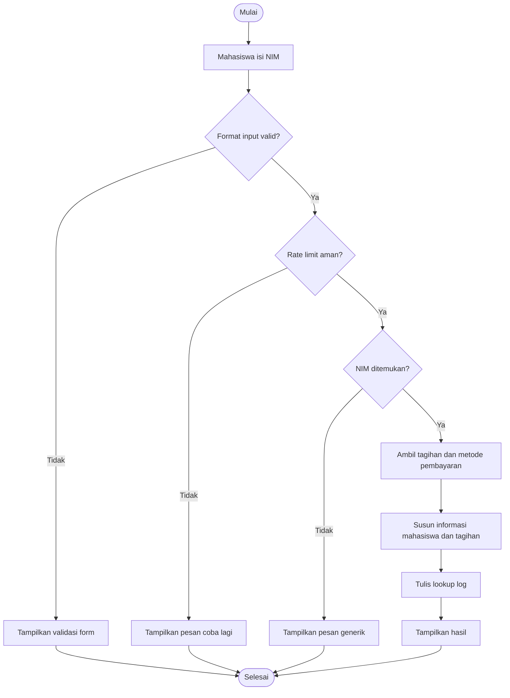
```mermaid
flowchart TD
    Start([Mulai]) --> Input[Mahasiswa isi NIM]
    Input --> Validate{Format input valid?}
    Validate -->|Tidak| Invalid[Tampilkan validasi form]
    Validate -->|Ya| Rate{Rate limit aman?}
    Rate -->|Tidak| Limited[Tampilkan pesan coba lagi]
    Rate -->|Ya| Match{NIM ditemukan?}
    Match -->|Tidak| NotFound[Tampilkan pesan generik]
    Match -->|Ya| Fetch[Ambil tagihan dan metode pembayaran]
    Fetch --> Mask[Susun informasi mahasiswa dan tagihan]
    Mask --> Log[Tulis lookup log]
    Log --> Result[Tampilkan hasil]
    Invalid --> End([Selesai])
    Limited --> End
    NotFound --> End
    Result --> End
```

## Activity Diagram Import Tagihan

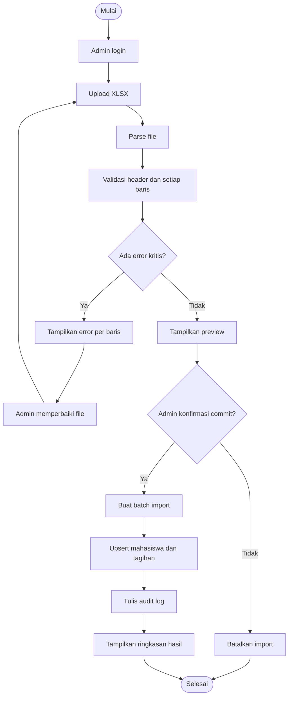
```mermaid
flowchart TD
    Start([Mulai]) --> Login[Admin login]
    Login --> Upload[Upload XLSX]
    Upload --> Parse[Parse file]
    Parse --> Validate[Validasi header dan setiap baris]
    Validate --> HasError{Ada error kritis?}
    HasError -->|Ya| ErrorList[Tampilkan error per baris]
    ErrorList --> Fix[Admin memperbaiki file]
    Fix --> Upload
    HasError -->|Tidak| Preview[Tampilkan preview]
    Preview --> Confirm{Admin konfirmasi commit?}
    Confirm -->|Tidak| Cancel[Batalkan import]
    Confirm -->|Ya| Batch[Buat batch import]
    Batch --> Upsert[Upsert mahasiswa dan tagihan]
    Upsert --> Audit[Tulis audit log]
    Audit --> Done[Tampilkan ringkasan hasil]
    Cancel --> End([Selesai])
    Done --> End
```

## BPMN-style Business Process Diagram

Diagram ini menggunakan swimlane Mermaid untuk merepresentasikan kolaborasi proses bisnis tingkat tinggi.

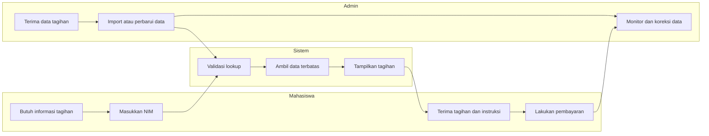
```mermaid
flowchart LR
    subgraph Mahasiswa
        M1[Butuh informasi tagihan] --> M2[Masukkan NIM]
        M3[Terima tagihan dan instruksi] --> M4[Lakukan pembayaran]
    end

    subgraph Sistem
        S1[Validasi lookup] --> S2[Ambil data terbatas]
        S2 --> S3[Tampilkan tagihan]
    end

    subgraph Admin
        A1[Terima data tagihan] --> A2[Import atau perbarui data]
        A2 --> A3[Monitor dan koreksi data]
    end

    A2 --> S1
    M2 --> S1
    S3 --> M3
    M4 --> A3
```

## C4 Container Diagram

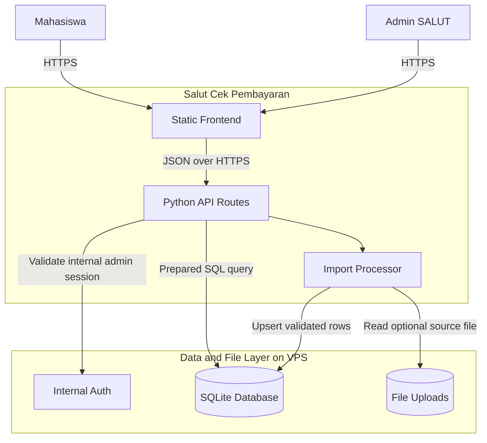
```mermaid
flowchart TB
    Student[Mahasiswa]
    Admin[Admin SALUT]

    subgraph System[Salut Cek Pembayaran]
        Web[Static Frontend]
        API[Python API Routes]
        Import[Import Processor]
    end

    subgraph VPSData[Data and File Layer on VPS]
        Auth[Internal Auth]
        DB[(SQLite Database)]
        Storage[(File Uploads)]
    end

    Student -->|HTTPS| Web
    Admin -->|HTTPS| Web
    Web -->|JSON over HTTPS| API
    API -->|Validate internal admin session| Auth
    API -->|Prepared SQL query| DB
    API --> Import
    Import -->|Read optional source file| Storage
    Import -->|Upsert validated rows| DB
```

## Data Lifecycle Diagram

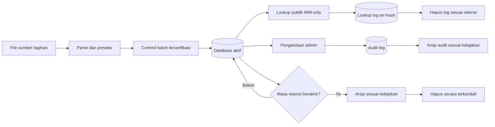
```mermaid
flowchart LR
    Source[File sumber tagihan] --> Preview[Parse dan preview]
    Preview --> Commit[Commit batch terverifikasi]
    Commit --> Active[(Database aktif)]
    Active --> Lookup[Lookup publik NIM-only]
    Active --> Admin[Pengelolaan admin]
    Lookup --> LookupLog[(Lookup log ter-hash)]
    Admin --> AuditLog[(Audit log)]
    Active --> Retention{Masa retensi berakhir?}
    Retention -->|Belum| Active
    Retention -->|Ya| Archive[Arsip sesuai kebijakan]
    Archive --> Purge[Hapus secara terkendali]
    LookupLog --> LogPurge[Hapus log sesuai retensi]
    AuditLog --> AuditArchive[Arsip audit sesuai kebijakan]
```

## Data Privacy Flow Diagram

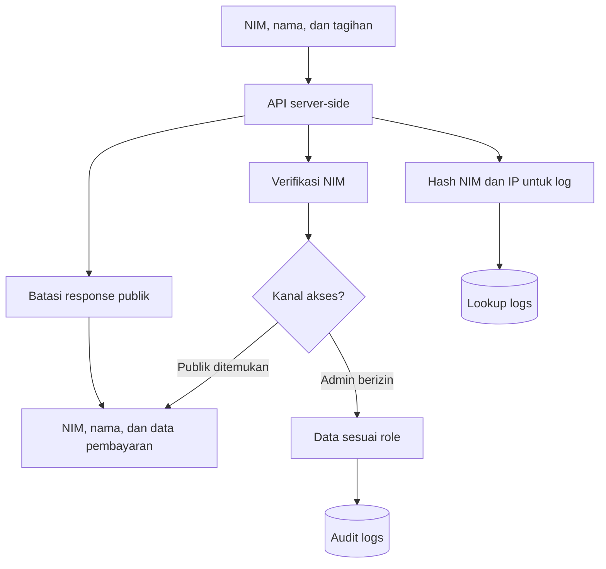
```mermaid
flowchart TD
    Raw[NIM, nama, dan tagihan] --> Server[API server-side]
    Server --> Verify[Verifikasi NIM]
    Server --> Minimize[Batasi response publik]
    Server --> Hash[Hash NIM dan IP untuk log]
    Verify --> Authorized{Kanal akses?}
    Authorized -->|Publik ditemukan| Public[NIM, nama, dan data pembayaran]
    Authorized -->|Admin berizin| Admin[Data sesuai role]
    Minimize --> Public
    Hash --> Logs[(Lookup logs)]
    Admin --> Audit[(Audit logs)]
```

## Authentication and Authorization Flow

```mermaid
sequenceDiagram
    actor Admin
    participant UI as Admin UI
    participant Auth as Internal Auth
    participant API as Admin API
    participant DB as SQLite

    Admin->>UI: Masukkan kredensial
    UI->>Auth: Login email dan password
    Auth-->>UI: Session token
    UI->>API: Request dengan session
    API->>Auth: Validasi session
    Auth-->>API: User terautentikasi
    API->>DB: Ambil role dan status admin
    DB-->>API: Role dan is_active
    API->>API: Periksa izin endpoint
    alt Role diizinkan dan akun aktif
        API-->>UI: Response berhasil
    else Tidak diizinkan
        API-->>UI: 401 atau 403
    end
```

## Import Validation Decision Tree

```mermaid
flowchart TD
    File[File import] --> Type{Tipe dan ukuran file valid?}
    Type -->|Tidak| Reject[Reject preview]
    Type -->|Ya| Header{Header wajib lengkap?}
    Header -->|Tidak| Reject
    Header -->|Ya| Rows{Semua baris valid?}
    Rows -->|Tidak| ShowErrors[Tampilkan error per baris]
    Rows -->|Ya| Duplicate{Ada duplikasi atau konflik?}
    Duplicate -->|Tidak| Preview[Siapkan preview]
    Duplicate -->|Ya| Mode{Konflik dapat di-upsert?}
    Mode -->|Tidak| ShowErrors
    Mode -->|Ya| Preview
    Preview --> Confirm{Admin konfirmasi?}
    Confirm -->|Tidak| Cancel[Batalkan]
    Confirm -->|Ya| Commit[Commit atomik]
    Commit --> Audit[Tulis audit log]
```

## Backup and Recovery Flow

```mermaid
flowchart TD
    Incident[Insiden terdeteksi] --> Classify{Jenis insiden?}
    Classify -->|Deploy bermasalah| Rollback[Rollback service VPS ke release sebelumnya]
    Classify -->|Import data salah| Correct[Nonaktifkan batch dan koreksi data]
    Classify -->|Database rusak| Restore[Restore file SQLite dari backup]
    Classify -->|Secret bocor| Rotate[Rotasi secret dan restart service]
    Rollback --> Verify[Verifikasi integritas dan smoke test]
    Correct --> Verify
    Restore --> Verify
    Rotate --> Verify
    Verify --> Healthy{Layanan sehat?}
    Healthy -->|Tidak| Escalate[Eskalasi dan lanjutkan recovery]
    Healthy -->|Ya| Report[Catat insiden dan tindak lanjut]
    Escalate --> Classify
```

## CI/CD Pipeline Diagram

```mermaid
flowchart LR
    Branch[Feature branch] --> PR[Pull request]
    PR --> Checks[Lint, test, dan build]
    Checks --> Passed{Checks lulus?}
    Passed -->|Tidak| Fix[Perbaiki perubahan]
    Fix --> Branch
    Passed -->|Ya| Staging[Deploy ke staging VPS]
    Staging --> Review[Code review dan UAT]
    Review --> Approved{Disetujui?}
    Approved -->|Tidak| Fix
    Approved -->|Ya| Merge[Merge ke main]
    Merge --> Production[Deploy production ke VPS]
    Production --> Smoke[Smoke test]
    Smoke --> Release[Release notes dan monitoring]
```

## Sitemap / Information Architecture

```mermaid
flowchart TD
    Public[Area Publik] --> Lookup[Cek Tagihan]
    Lookup --> Result[Hasil Tagihan]
    Result --> Payment[Instruksi Pembayaran]
    Public --> Help[Bantuan dan Kontak]

    AdminArea[Area Admin] --> Login[Login Admin]
    Login --> Dashboard[Dashboard]
    Dashboard --> Students[Mahasiswa]
    Dashboard --> Bills[Tagihan]
    Dashboard --> Imports[Import Tagihan]
    Dashboard --> Methods[Metode Pembayaran]
    Dashboard --> Audit[Audit Log]
    Dashboard --> Settings[Pengaturan]
    Settings --> Users[Admin dan Role]
```
